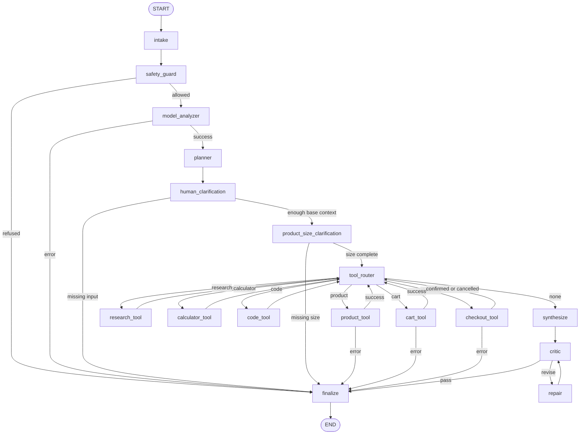

# Nodes And Edges

## Graph



## Nodes

| Node | Main behavior |
|---|---|
| `intake` | Trims and normalizes whitespace. It does not classify intent. |
| `safety_guard` | Blocks known unsafe patterns before a model call. |
| `model_analyzer` | Calls structured model analysis for intent, constraints, and missing questions. |
| `planner` | Builds a plan and selects tools from model-derived intent. |
| `human_clarification` | Returns model questions except size questions. |
| `product_size_clarification` | Returns the model-generated size question separately. |
| `tool_router` | Reads the first item in `pending_tools`. |
| `research_tool` | Reads local LangGraph and FastAPI knowledge. |
| `calculator_tool` | Safely evaluates arithmetic. |
| `code_tool` | Inspects workspace files. |
| `product_tool` | Calls model research and structured product generation. |
| `cart_tool` | Adds the resolved product, quantity, color, and size to the cart. |
| `checkout_tool` | Requires final confirmation and calls the configured order gateway. |
| `synthesize` | Formats product schemas or drafts a non-product answer. |
| `critic` | Applies intent-specific quality checks. |
| `repair` | Adds missing details while revision budget remains. |
| `finalize` | Returns `ok`, `needs_input`, `refused`, or `error`. |

## Conditional Edges

| From | Route | To |
|---|---|---|
| `safety_guard` | `analyze` | `model_analyzer` |
| `safety_guard` | `refuse` | `finalize` |
| `model_analyzer` | `plan` | `planner` |
| `model_analyzer` | `error` | `finalize` |
| `human_clarification` | `ask_human` | `finalize` |
| `human_clarification` | `continue` | `product_size_clarification` |
| `product_size_clarification` | `ask_human` | `finalize` |
| `product_size_clarification` | `continue` | `tool_router` |
| `tool_router` | tool name | matching tool node |
| `tool_router` | `synthesize` | `synthesize` |
| `product_tool` | `continue` | `tool_router` |
| `product_tool` | `error` | `finalize` |
| `cart_tool` | `continue` | `tool_router` |
| `cart_tool` | `error` | `finalize` |
| `checkout_tool` | `continue` | `tool_router` |
| `checkout_tool` | `error` | `finalize` |
| `critic` | `repair` | `repair` |
| `critic` | `finalize` | `finalize` |

## Product Example

For `Find a product under 50 dollars`, the model may return:

```json
{
  "intent": "product_search",
  "budget": 50,
  "missing_fields": ["product_type", "color", "strict_budget"],
  "questions": [
    {
      "id": "product_type",
      "question": "Which product name or type should I search for?",
      "type": "text",
      "options": [],
      "required": true
    }
  ]
}
```

After the answers are resubmitted, `model_analyzer` runs again. If the product
is footwear or clothing, its structured output can contain a `size` question.
The graph deliberately routes that question through
`product_size_clarification` before product research.

The exact wording and options are model output, so clients must render questions
dynamically rather than assuming a fixed set.

## Checkout Example

```text
add_to_cart -> missing size? -> cart_tool -> artifacts.cart
checkout -> missing shipping? -> finalize(needs_input)
checkout -> shipping complete -> confirm_order question
checkout + confirm_order=yes -> checkout_tool -> simulated order
```

The model determines intent and missing questions, but deterministic checkout
code independently refuses placement unless `order_confirmed` is exactly true.
