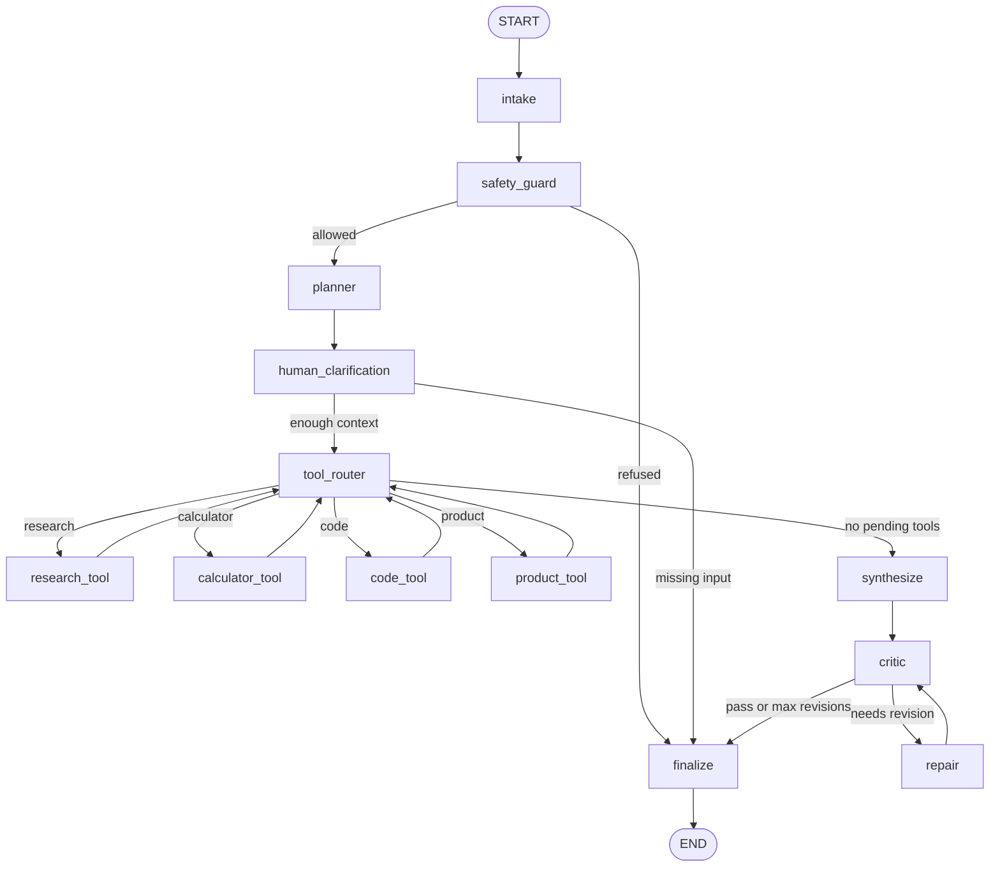

# Nodes And Edges

This document explains how the LangGraph workflow is connected. The source of
truth is `app/agents/graph.py`.

## Graph Diagram



## Nodes

| Node | Function | What It Does |
| --- | --- | --- |
| `intake` | `intake_node` | Cleans the user request and classifies the broad intent. |
| `safety_guard` | `safety_guard_node` | Checks for blocked request patterns before the agent plans or uses tools. |
| `planner` | `planner_node` | Builds the plan and chooses tools for the request. |
| `human_clarification` | `human_clarification_node` | Asks the human for missing context, such as product type, color, or yes/no budget confirmation. |
| `tool_router` | `tool_router_node` | Looks at `pending_tools` and decides which tool should run next. |
| `research_tool` | `research_tool_node` | Adds local knowledge-base facts to `artifacts["research"]`. |
| `calculator_tool` | `calculator_tool_node` | Safely evaluates arithmetic and stores the result in `artifacts["calculation"]`. |
| `code_tool` | `code_tool_node` | Inspects the current workspace and stores file metadata in `artifacts["code"]`. |
| `product_tool` | `product_tool_node` | Searches a small sample product catalog using budget, product type, color, and yes/no budget preference. |
| `synthesize` | `synthesize_node` | Creates a draft answer from the plan and artifacts. |
| `critic` | `critic_node` | Scores the draft and decides whether repair is needed. |
| `repair` | `repair_node` | Adds missing sections or details identified by the critic. |
| `finalize` | `finalize_node` | Produces the final answer or refusal message. |

## Edges

| From | To | Type | Condition |
| --- | --- | --- | --- |
| `START` | `intake` | Normal | Every run starts here. |
| `intake` | `safety_guard` | Normal | Intake always hands off to safety. |
| `safety_guard` | `planner` | Conditional | `route_after_safety()` returns `plan`. |
| `safety_guard` | `finalize` | Conditional | `route_after_safety()` returns `refuse`. |
| `planner` | `human_clarification` | Normal | Planning always gives the human check a chance to inspect context. |
| `human_clarification` | `finalize` | Conditional | `route_after_human_clarification()` returns `ask_human`. |
| `human_clarification` | `tool_router` | Conditional | `route_after_human_clarification()` returns `continue`. |
| `tool_router` | `research_tool` | Conditional | `route_tools()` returns `research`. |
| `tool_router` | `calculator_tool` | Conditional | `route_tools()` returns `calculator`. |
| `tool_router` | `code_tool` | Conditional | `route_tools()` returns `code`. |
| `tool_router` | `product_tool` | Conditional | `route_tools()` returns `product`. |
| `tool_router` | `synthesize` | Conditional | `route_tools()` returns `synthesize` when no tools remain. |
| `research_tool` | `tool_router` | Normal | Tool completes and returns to the router. |
| `calculator_tool` | `tool_router` | Normal | Tool completes and returns to the router. |
| `code_tool` | `tool_router` | Normal | Tool completes and returns to the router. |
| `product_tool` | `tool_router` | Normal | Product search completes and returns to the router. |
| `synthesize` | `critic` | Normal | Every draft is reviewed. |
| `critic` | `repair` | Conditional | `route_after_critic()` returns `repair`. |
| `critic` | `finalize` | Conditional | `route_after_critic()` returns `finalize`. |
| `repair` | `critic` | Normal | Repaired drafts are reviewed again. |
| `finalize` | `END` | Normal | Final output ends the graph run. |

## Tool Loop

The planner stores selected tools in `pending_tools`. The router always reads the
first item:

- If the first item is `research`, the graph runs `research_tool`.
- If the first item is `calculator`, the graph runs `calculator_tool`.
- If the first item is `code`, the graph runs `code_tool`.
- If the first item is `product`, the graph runs `product_tool`.
- If no items remain, the graph moves to `synthesize`.

Each tool removes itself from `pending_tools`, adds its output to `artifacts`,
adds itself to `completed_tools`, and returns to `tool_router`.

## Human Interaction Loop

The `human_clarification` node checks whether the graph has enough context before
tool use. Product-search requests are the clearest example:

```text
Find a product under 50 dollars.
```

The agent knows the budget, but it does not know the product type, preferred
color, or whether the budget is strict. In that case, it returns:

```json
{
  "status": "needs_input",
  "human_questions": [
    {
      "id": "product_type",
      "question": "What product type should I search for?",
      "type": "text"
    },
    {
      "id": "color",
      "question": "Which color do you want?",
      "type": "choice",
      "options": ["black", "white", "blue", "green", "any"]
    },
    {
      "id": "strict_budget",
      "question": "Should I only show products under the stated budget?",
      "type": "yes_no",
      "options": ["yes", "no"]
    }
  ]
}
```

The next API call includes those answers in `context.human_answers`. Then the
graph routes from `human_clarification` to `tool_router` and continues normally.

The product result changes from those answers. For example, blue speaker answers
return `Compact Bluetooth Speaker`, while blue backpack answers return
`City Blue Backpack`. If the user answers `strict_budget=no`, the product tool can
include over-budget options and marks them with `over_budget: true`.

## Critique And Repair Loop

The `critic` node checks the draft for length, plan visibility, tool findings,
FastAPI mention, and LangGraph mention. If issues remain and `revision_count` is
below `max_revisions`, the graph routes to `repair`. The repair node updates the
draft and sends it back to `critic`.

The loop stops when either:

- The critic finds no required repair.
- The maximum revision count is reached.

After that, the graph routes to `finalize`.
