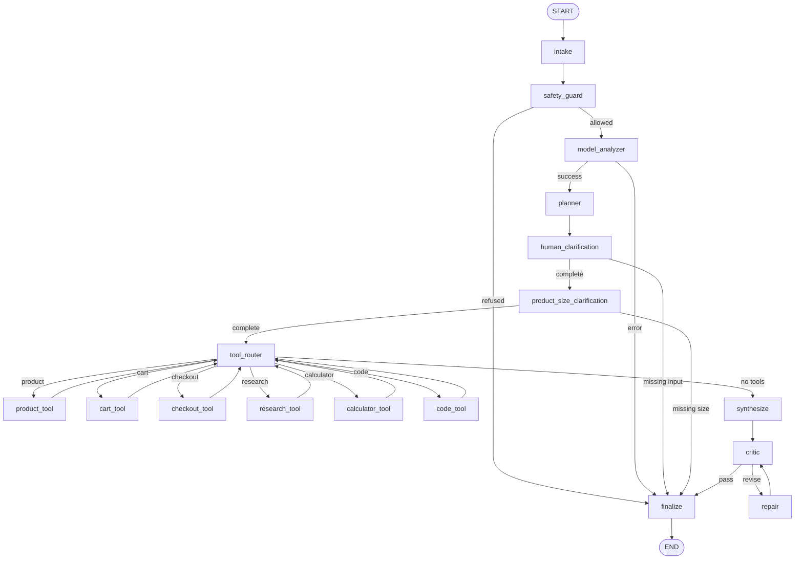

# Complete Project Guide

This is the single-document overview of every topic covered in the project and
our implementation discussion.

## 1. Project Goal

The project demonstrates how to combine:

- FastAPI for HTTP endpoints and request validation.
- LangGraph for a multi-node agent workflow.
- Gemini structured outputs for intent and missing-information analysis.
- Optional web search for current product recommendations.
- Human interaction for incomplete requests.
- Cart and checkout actions with explicit order confirmation.
- A browser UI for manually testing the complete flow.
- Deterministic tests that do not call a paid model.

The production product flow does not use a static product catalog.

## 2. Original 404 Problem

Uvicorn was running correctly, but `GET /` returned `404 Not Found` because the
FastAPI application initially had no root route.

The project now defines:

| Endpoint | Purpose |
|---|---|
| `GET /` | Browser testing UI. |
| `GET /favicon.ico` | Empty favicon response that avoids a browser 404. |
| `GET /health` | Service health check. |
| `GET /agent/graph` | Node, edge, and Mermaid graph metadata. |
| `POST /agent/run` | Creates one agent execution. |
| `GET /docs` | FastAPI Swagger documentation. |

## 3. API And CRUD Meaning

The current API starts with the create operation:

```text
POST /agent/run
```

Every call creates a new graph execution. The API is currently stateless, so a
human continuation sends the original query again with accumulated context.

A persistent CRUD version could later add:

| Operation | Example endpoint |
|---|---|
| Create run | `POST /agent/runs` |
| Read run | `GET /agent/runs/{run_id}` |
| Continue run | `POST /agent/runs/{run_id}/responses` |
| Cancel run | `DELETE /agent/runs/{run_id}` |

LangGraph checkpointing and a `thread_id` would allow the same execution to
resume rather than rebuilding state from the client context.

## 4. Intent Design: Dynamic Or Static?

The intent system is intentionally hybrid.

### Static Intent Contract

The application defines seven supported intents:

1. `product_search`
2. `add_to_cart`
3. `checkout`
4. `calculation`
5. `software_delivery`
6. `documentation`
7. `general_assistance`

The list is static because LangGraph needs known actions and edges. The model
cannot invent an unsupported action and cause arbitrary code to run.

### Dynamic Classification

The model dynamically reads the user's natural language and selects one of the
seven allowed values.

These requests can all map to `product_search` without hardcoded sentences:

```text
Give me a product under 50 dollars.
Find an item below $40.
Show me affordable running shoes.
```

These requests can map to `add_to_cart`:

```text
Add the blue shoe to my cart.
Put two of those in my basket.
I want the black shirt in size M.
```

The Pydantic `Literal` provides the static contract, while Gemini JSON-schema
generation performs dynamic classification.

## 5. Model-Backed Analysis

`model_analyzer` sends the request and collected context to the model. The
structured `ProductRequestAnalysis` can contain:

- Intent and normalized request.
- Product type and product name.
- Product URL and supported price.
- Budget, currency, and strict-budget preference.
- Color, size, and quantity.
- Shipping fields.
- Final order confirmation.
- Missing fields.
- Dynamically generated human questions.

The collected context can include:

```text
context.human_answers
context.previous_products
context.cart
```

If the configured provider key is missing or a model call fails, the graph
returns `status=error`. It never silently falls back to static products.

## 6. LangGraph Nodes

| Node | Responsibility |
|---|---|
| `intake` | Normalize the incoming text. |
| `safety_guard` | Block known unsafe request patterns. |
| `model_analyzer` | Dynamically select intent and identify missing information. |
| `planner` | Create an intent-specific plan and pending tool list. |
| `human_clarification` | Ask non-size questions generated by the model. |
| `product_size_clarification` | Ask a separate clothing or footwear size question. |
| `tool_router` | Route to the next pending tool. |
| `research_tool` | Return local FastAPI and LangGraph knowledge. |
| `calculator_tool` | Safely calculate arithmetic expressions. |
| `code_tool` | Inspect the local project structure. |
| `product_tool` | Use the model and optional web search to recommend products. |
| `cart_tool` | Add or merge a product, variant, and quantity in the cart. |
| `checkout_tool` | Validate confirmation and call the configured order gateway. |
| `synthesize` | Format a natural response from structured artifacts. |
| `critic` | Apply intent-specific quality checks. |
| `repair` | Improve a weak draft within the revision limit. |
| `finalize` | Return success, human input, refusal, or error. |

## 7. Nodes And Edges



Conditional edge functions read graph state and return route labels such as
`plan`, `error`, `ask_human`, `continue`, `repair`, or `finalize`.

## 8. Intent-To-Tool Routing

The model selects intent dynamically, then deterministic code selects tools:

```python
{
    "product_search": ["product"],
    "add_to_cart": ["cart"],
    "checkout": ["checkout"],
    "calculation": ["calculator"],
    "software_delivery": ["research", "code"],
    "documentation": ["research", "code"],
    "general_assistance": [],
}
```

`general_assistance` has no tools, so it routes directly to synthesis.

## 9. Human Interaction

For:

```text
Give me a product under 50 dollars.
```

the model knows the budget but may ask:

- Which product or product type?
- Which color?
- Is the budget strict?

After the client resubmits those answers, the model analyzes the enriched
context again. If the answer is a shirt or shoe, it can ask another question for
size.

Questions use one of these UI control types:

- `text`
- `choice`
- `yes_no`

Question wording and options are model-generated, so the UI renders them
dynamically instead of assuming fixed questions.

## 10. Product Recommendation

When all required product details are available:

1. `product_tool` asks the model to research suitable products.
2. Gemini Google Search grounding can provide current product and retailer pages.
3. Another Gemini JSON-schema call validates the response schema.
4. Results are stored in `artifacts.products`.

Product results can include:

- Exact matches and alternatives.
- Name and category.
- Price and currency when supported.
- Color and size options.
- Recommendation reason.
- Source URL.
- Availability note.
- Over-budget status.
- Price and stock verification caveats.

Price, shipping, stock, size, and color are external facts that users should
verify on the retailer page.

## 11. Personal Conversation

Messages such as:

```text
Hi, how are you man?
```

are classified as `general_assistance`. They receive a short, personal response:

```text
Hi! I'm doing well, thanks for asking. Is there a product you would like me to
help you find, or is there anything else I can help you with?
```

Casual responses do not expose plans, artifacts, intent labels, FastAPI, or
LangGraph details.

## 12. Add To Cart

For:

```text
Add Blue Running Shoe to my cart.
```

the model selects `add_to_cart`. It can ask for missing color, size, or quantity.
`cart_tool` then:

- Creates a cart item.
- Stores name, URL, price, currency, color, size, and quantity.
- Calculates line totals when price is known.
- Merges identical product variants.
- Calculates a subtotal when all item prices are known.
- Returns the updated cart in `artifacts.cart`.

The browser UI copies `artifacts.cart` to `context.cart` for the next request.

## 13. Checkout And Order Placement

For:

```text
Checkout my cart and place the order.
```

the model selects `checkout`.

The graph collects:

- Shipping name.
- Street address.
- City.
- State or region.
- Postal code.
- Country.
- Contact email.

It never asks for:

- Raw card numbers.
- Bank details.
- Passwords.
- PINs or security codes.

After all shipping details are complete, the graph asks the final question:

```json
{
  "id": "confirm_order",
  "type": "yes_no",
  "options": ["yes", "no"]
}
```

Behavior:

- `yes`: place the order through the configured gateway.
- `no`: cancel placement and keep the cart.
- Missing confirmation: deterministic checkout code refuses placement.

## 14. Automatic Ordering Safety

"Automatic placement" means the order tool runs immediately after the user gives
explicit final confirmation. The model cannot bypass this rule.

The included `DemoOrderGateway`:

- Creates a demo order ID.
- Returns `status=simulated_placed`.
- Masks the email in the receipt.
- Clears the cart after confirmed placement.
- Does not contact a retailer.
- Does not charge a payment processor.

A real implementation should replace it with an authenticated `OrderGateway`
using retailer APIs and provider-hosted tokenized payment. Raw payment data
should never pass through prompts or graph state.

## 15. Browser Test UI

The root UI supports:

- Running arbitrary agent queries.
- Loading a product-search example.
- Loading an add-to-cart example.
- Loading a checkout example.
- Loading a calculator example.
- Rendering model product results with one-click Add actions.
- Showing cart items, quantity, variants, and subtotal outside raw JSON.
- Starting checkout directly from the visible cart.
- Showing the latest demo order or cancellation result.
- Rendering dynamic human questions.
- Continuing with accumulated answers.
- Persisting previous products, cart, and last order in context.
- Viewing status, artifacts, trace, and route history.
- Opening Swagger and graph metadata.

## 16. API Status Values

| Status | Meaning |
|---|---|
| `ok` | The run completed successfully. |
| `needs_input` | The client must answer human questions and resubmit. |
| `refused` | The safety guard blocked the request. |
| `error` | Configuration, model, validation, or tool execution failed. |

## 17. Testing Strategy

Automated tests inject `FakeProductModel` through the same model protocol. This
keeps tests deterministic and avoids paid or network calls.

Coverage includes:

- Software delivery and documentation routes.
- Calculator routing.
- Personal greeting behavior.
- Generic product intent classification.
- Missing product information.
- Shirt and shoe size interaction.
- Different recommendations from different answers.
- Strict and flexible budgets.
- Add-to-cart size questions.
- Cart quantity and subtotal.
- Shipping collection.
- Final confirmation question.
- Confirmed demo placement.
- Cart clearing after placement.
- Cancellation after `no`.
- Direct refusal to place without explicit confirmation.
- Safety refusal.
- Model configuration errors.
- Root UI and API responses.
- Graph node and edge metadata.

Run:

```bash
.venv/bin/python -m pytest -q
```

## 18. Main Files

| File | Purpose |
|---|---|
| `app/main.py` | FastAPI routes and application setup. |
| `app/ui.py` | Browser testing interface and client-side context persistence. |
| `app/agents/graph.py` | LangGraph registration, nodes, edges, and compilation. |
| `app/agents/nodes.py` | Node behavior, routing, cart, checkout, and synthesis. |
| `app/agents/product_model.py` | Intent schema, Gemini/OpenAI providers, structured outputs, and grounded search. |
| `app/agents/commerce.py` | Order gateway protocol and safe demo gateway. |
| `app/agents/state.py` | Shared graph-state types. |
| `app/agents/tools.py` | Local research, calculator, and workspace tools. |
| `app/agents/schemas.py` | FastAPI request and response schemas. |
| `tests/conftest.py` | Injected fake model. |
| `tests/test_agent_graph.py` | Workflow, API, cart, checkout, and safety tests. |

## 19. Configuration

```dotenv
MODEL_PROVIDER=gemini
GEMINI_API_KEY=your-key
GEMINI_MODEL=gemini-3.5-flash
GEMINI_ENABLE_GOOGLE_SEARCH=true
AGENT_USE_MODEL=true
```

- `MODEL_PROVIDER` defaults to `gemini`; `openai` remains optional.
- `GEMINI_API_KEY` is required for Gemini model and commerce flows.
- `GEMINI_MODEL` selects the Gemini model.
- `GEMINI_ENABLE_GOOGLE_SEARCH` controls grounded product research.
- `AGENT_USE_MODEL` controls optional non-product model synthesis.

## 20. Production Roadmap

- Add LangGraph checkpointing and persistent `thread_id` support.
- Store runs, carts, orders, and confirmations in a database.
- Add user authentication and cart ownership.
- Add retailer or inventory APIs.
- Replace the demo gateway with an authenticated order integration.
- Use provider-hosted tokenized payment.
- Revalidate price, variant, stock, shipping, and tax before confirmation.
- Show a final itemized order summary.
- Add idempotency keys to prevent duplicate orders.
- Add rate limits, timeouts, retries, and circuit breakers.
- Add secret management and approved retailer policies.
- Add structured logs, request IDs, token cost, latency, and tool-use metrics.
- Add prompt and model versioning.
- Add intent, grounding, broken-link, and checkout evaluation datasets.

This file is the complete project overview. The other documents provide deeper
API examples, architecture notes, graph tables, and implementation roadmap.
